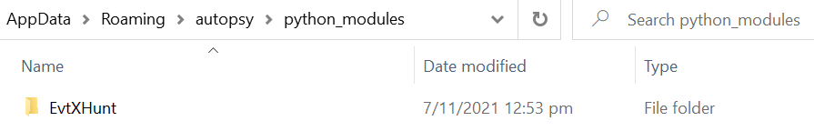

# EvtXHunt by F34R 0f FOR3N5ICS
## Introduction
EvtXHunt is mainly an Autopsy plugin that is able to analyse Windows EVTX logs against a library of SIGMA rules. EvtXHunt can also function as a commandline interface tool to serve the same purpose of analysing EVTX files against a set of SIGMA rules.

## Requirements
- Python 2.7x
- Windows Environment

## Usage
### Autopsy Plugin Setup
#### Installation
Open Autopsy plugin folder as follows:


Copy the repository into Autopsy plugin folder as follows:


#### Running Autopsy plugin
Run ingest module as follows:


Select EvtXHunt and click Finish as follows:


Analysis result can be found under the **Data Artifacts** as follows:


---
### CommandLine Usage
#### Installation

```bash
git clone git@github.com:Lyc4on/EvtXHunt.git
pip install -r requirements.txt
```

#### Compiling Python EXE
Note that this has to be done in a Windows environment. A copy of the compiled EXE binary can be found in the repository root path named **EvtXHunt.py**.

```bash
pyinstaller EvtXHunt.py -F --hidden-import="pyevtx" --hidden-import="yaml" --hidden-import="sqlalchemy.sql.default_comparator"
```

#### Running Command-Line Tool
The command-line tool can be runned using either **EvtXHunt.py** or **EvtXHunt.exe**
```bash
# -f : relative path of folder containing EVTX files
# -r : relative path of folder containining .JSON rules
# -o : absolute path to output .csv analysis
python EvtXHunt.py -f evtx_samples -r rules -o C:\\Users\\nic\\Desktop\\SIT_Local\\evtxIOC\\temp\\sub

EvtXHunt.exe -f evtx_samples -r rules -o C:\\Users\\nic\\Desktop\\SIT_Local\\evtxIOC\\temp\\sub
```

---

### Creating SQL Query .json rules from SIGMA .yml files

Use the **sigmac** binary to facilite the conversion of .yml rules into .json rules containing the respective SQL query statement.

```bash
git clone https://github.com/SigmaHQ/sigma.git
cd tools
python setup.py install # setup necessary requirements in python environment

# -I : ignore backend errors 
# -t : target backend
# -r : recurse, used for directory
# -oF : output format {json, yaml}
# -o : output filename
# -of : output fields, include extra fields from the SIGMA .yml rules to be included in the output file

# To convert a folder of multiple .yml SIGMA rules into a single .json file
sigmac -I -t sqlite -c config/generic/sysmon.yml -r ../rules/windows/ -oF json -o test.json -of title,description

# To convert a single .yml SIGMA rule into a single .json file
sigmac -I -t sqlite -c config/generic/sysmon.yml ../rules/windows/create_remote_thread/sysmon_suspicious_remote_thread.yml -oF json -o single.json -of title,description
```

#### Adding new .json rules to tool library
All .json rules has to be placed in the rules folder.

## References
- [EVTX-ATTACK-SAMPLES](https://github.com/sbousseaden/EVTX-ATTACK-SAMPLES) (EVTX Files)
- [SigmaHQ](https://github.com/SigmaHQ/sigma) (Sigma Main repository)
